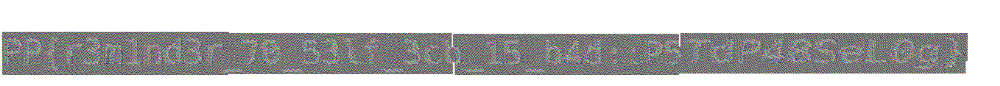

# Crypto Basic Challenge

**Category:** Crypto  
**Difficulty:** Easy  
**CTF:** Platypwn 2025

## Challenge Description
I left an encrypted note to my future self. I used the printer’s very secure “encrypted print” function to get a physical copy. But then I accidentally dropped the picture into the strip-cut shredder, which claims that its military-grade paper strips perfectly destroy documents. I scanned the snippets for you. Can you recover my message?

## Files and Resources

- [File](all-slices.zip) - Original file

## Solution

### Step 1: Unzip and analyze the images

This was a typical image shredder problem. The zip contained 12 individual images that needed to be reconstructed to reveal the flag.

While these types of challenges often require automation, this one was simple enough to solve manually.

### Step 2: Manually arrange the images to reconstruct the flag

I used MS Paint to manually copy, paste, and arrange the shredded pieces until the original message was visible.



## Flag

```
PP{r3m1nd3r_70_53lf_3cb_15_b4d::P5TdP48SeL0g}
```

## Tools Used

- `MS Paint` - for manually arranging the images


