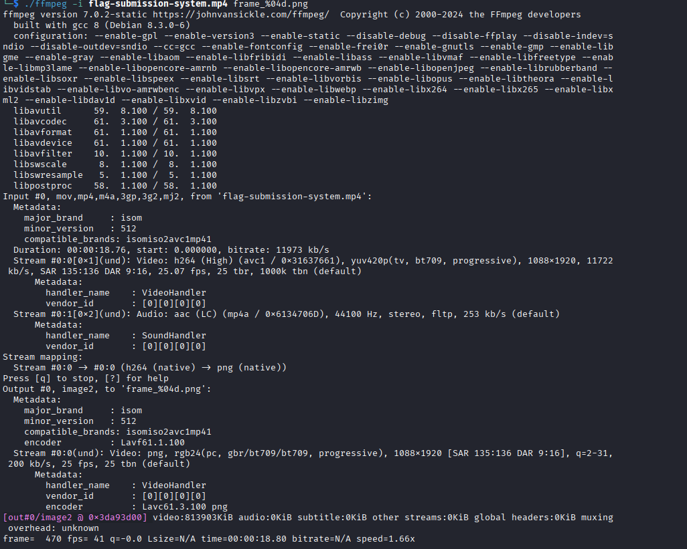
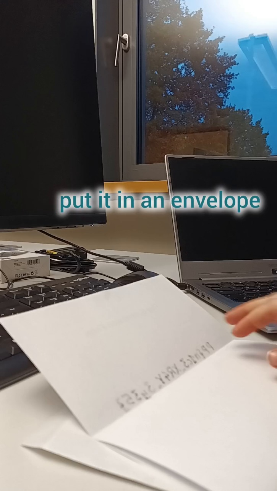

# OSNIT Basic Challenge

**Category:** OSNIT  
**Difficulty:** Easy  
**CTF:** Platypwn 2025

## Challenge Description
For this Platypwn, we thought about a new and super secure Flag Submission System! To make it easier for you, we made a tutorial video where you can learn how it works.

## Files and Resources

- [Actual Video](flag-submission-system.mp4) - Original video

## Solution

### Step 1: Video Analysis

This appears to be a normal MP4 file.
After watching the video, we can see that at around 0:10, the flag appears for a fraction of a second.

I tried to pause the video at the exact moment, but I couldn’t get the timing correctly. Therefore, we need to analyze the video frame by frame.
Used `ffmpeg` command to extract each frame as a PNG image::

```bash
./ffmpeg -i flag-submission-system.mp4 frame_%04d.png
```



### Step 2: Examine the Frames

Next, I reviewed the extracted images to identify the exact frame containing the flag.



### Step 3: Flag Extraction

Finally, I found the flag in the selected frame.

> **Note:**The frame with the flag was rotated and inverted, but it was easy to correct.

## Flag

```
PP{n1c3_XR4Y_3y35}
```

## Tools Used

- `ffmpeg` - for extracting video frames


